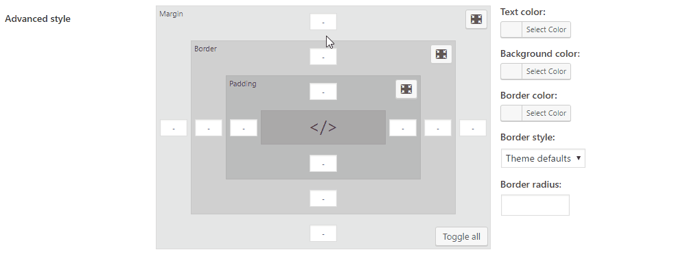

CMB2 Field Type: Visual Style Editor
==================

Custom field for [CMB2](https://github.com/CMB2/CMB2) setup style from small set of controls.



## Examples

```php
add_action( 'cmb2_admin_init', 'cmb2_visual_style_editor_metabox' );
function cmb2_position_metabox() {

	$prefix = 'your_prefix_demo_';

	$cmb_demo = new_cmb2_box( array(
		'id'            => $prefix . 'metabox',
		'title'         => __( 'Visual Style Editor Metabox', 'cmb2' ),
		'object_types'  => array( 'page', 'post' ), // Post type
	) );

	$cmb_demo->add_field( array(
		'name'          => __( 'Default field', 'cmb2' ),
		'desc'          => __( 'Field description (optional)', 'cmb2' ),
		'id'            => $prefix . 'visual_style_editor',
		'type'          => 'visual_style_editor',
	) );

	$cmb_demo->add_field( array(
        'name'          => __( 'Default field', 'cmb2' ),
        'desc'          => __( 'Field description (optional)', 'cmb2' ),
        'id'            => $prefix . 'visual_style_editor',
        'type'          => 'visual_style_editor',
        //'hide_margin'   => true,
        'hide_border'   => true,
        //'hide_padding'   => true,
        //'hide_text_options'   => true,
        //'hide_text_options'   => true,
        //'hide_background_options'   => true,
        //'hide_border_options'   => true,
    ) );

}
```

## Parameters

- hide_margin (bool, default = false): Hide margin inputs square
- hide_border (bool, default = false): Hide border inputs square
- hide_padding (bool, default = false): Hide padding inputs square
- hide_text_options (bool, default = false): Hide text color option
- hide_background_options (bool, default = false): Hide background color option
- hide_border_options (bool, default = false): Hide border color, style and radius options

## Retrieve the field value

```php
    $value = get_post_meta( get_the_ID(), 'your_field_id', false );

    // Getting margin, border and padding
    $content_wrap_groups = array( 'margin', 'border', 'padding' );

    foreach( $content_wrap_groups as $content_wrap_group ) {
        if( isset( $value[$content_wrap_group . '_all'] ) && ! empty( $value[$content_wrap_group . '_all'] ) ) {
            echo $content_wrap_group . ': ' . $value[$content_wrap_group . '_all'] . ';<br>';
        } else {
            if( isset( $value[$content_wrap_group . '_top'] ) && ! empty( $value[$content_wrap_group . '_top'] ) ) {
                echo $content_wrap_group . '-top: ' . $value[$content_wrap_group . '_top'] . ';<br>';
            }

            if( isset( $value[$content_wrap_group . '_right'] ) && ! empty( $value[$content_wrap_group . '_right'] ) ) {
                echo $content_wrap_group . '-right: ' . $value[$content_wrap_group . '_right'] . ';<br>';
            }

            if( isset( $value[$content_wrap_group . '_bottom'] ) && ! empty( $value[$content_wrap_group . '_bottom'] ) ) {
                echo $content_wrap_group . '-bottom: ' . $value[$content_wrap_group . '_bottom'] . ';<br>';
            }

            if( isset( $value[$content_wrap_group . '_left'] ) && ! empty( $value[$content_wrap_group . '_left'] ) ) {
                echo $content_wrap_group . '-left: ' . $value[$content_wrap_group . '_left'] . ';<br>';
            }
        }
    }

    // Getting extra options

    // Text color
    if( isset( $value['text_color'] ) && ! empty( $value['text_color'] ) ) {
        echo 'color: ' . $value['text_color'] . ';<br>';
    }

    // Background color
    if( isset( $value['background_color'] ) && ! empty( $value['background_color'] ) ) {
        echo 'background-color: ' . $value['background_color'] . ';<br>';
    }

    // Border color
    if( isset( $value['border_color'] ) && ! empty( $value['border_color'] ) ) {
        echo 'border-color: ' . $value['border_color'] . ';<br>';
    }

    // Border style
    if( isset( $value['border_style'] ) && ! empty( $value['border_style'] ) ) {
        echo 'border-style: ' . $value['border_style'] . ';<br>';
    }

    // Border radius
    if( isset( $value['border_radius'] ) && ! empty( $value['border_radius'] ) ) {
        echo 'border-radius: ' . $value['border_radius'] . ';<br>';
    }
```

## Changelog

### 1.0.0
* Initial commit
